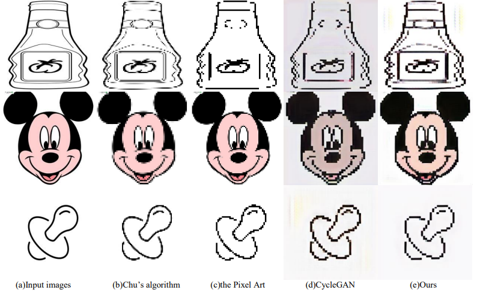
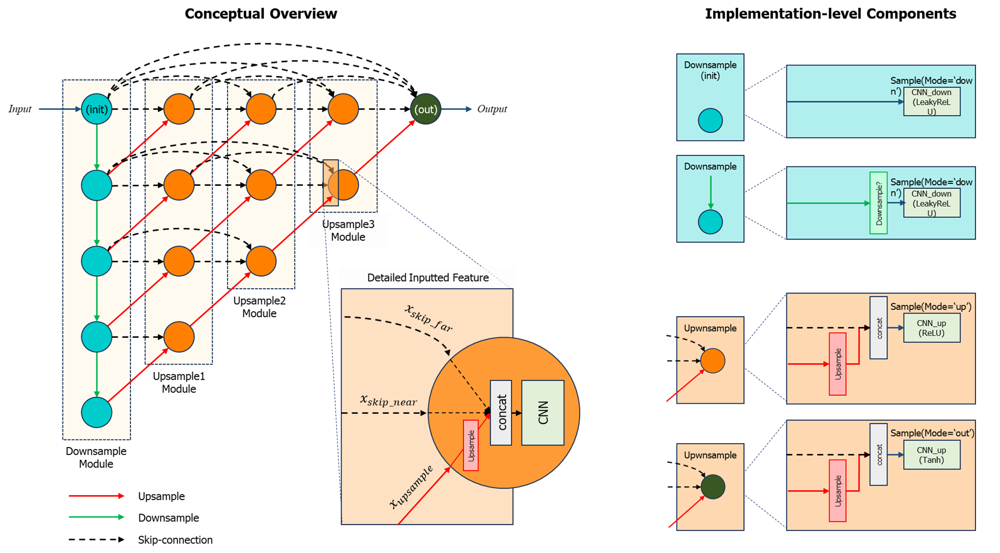

# PixelCycleGAN - Unofficial Pytorch Implementation

>
>
> Image source: *["A Pixel image generation algorithm based on CycleGAN"](https://ieeexplore.ieee.org/document/9482118)* (figure 5, page. 4)


         

This repository is an unofficial Pytorch implementation of ["A Pixel image generation algorithm based on CycleGAN"](https://ieeexplore.ieee.org/document/9482118) ([https://doi.org/10.1109/IMCEC51613.2021.9482118)](https://doi.org/10.1109/IMCEC51613.2021.9482118)).

## PixelCycleGAN Overview

This papaer aims to pixelize the cartoon images based on CycleGAN scheme and Nested UNet (Unet++) as generator, PatchGAN discriminator with 70 x 70 receptive fields.

To implemente this paper, I redrew the generator architecture figure as below:




## Experimental Environments

- os : ubuntu
- gpu : 8 X A100 (80G)
- pytorch : 1.12

## Changes from the original paper

***Because the dataset link in paper was broken or unavailable due to commercial usage, we manually collected our custom unpaired cartoon-pixel dataset in internet.***

### Dataset

| Dataset | # imgs | Query | Web site |
|:---:|:---:|:---:|:---:|
| (C) Cartoon | 2,000 | {*'cartoon'*, *'cartoon image'*} | Google, shutterstuck
| (P) Pixel Art | 2,000 | {*'pixel art'*, *'pixel art image'*} | Google

## Installation

```shell
git clone https://github.com/gh-BumsooKim/PixelCycleGAN
cd PixelCycleGAN

# download training dataset
sh download_training_datset.sh
rm cookie
unzip pixel_cartoon_dataset.zip -r dataset

# download pre-trained PixelCycleGAN model
sh download_pixelcylcegan.sh
unzip pretrained_pixelcyclegan.zip -r pretrained
```


## Training

```shell
python train.py
```


## Inference

```shell
python test.py
```

## Results

[Papers]

*TBA*

[Our Implementation]

*TBA*

## Acknowledge

Since this paper mainly based on CycleGAN, we also heavily built this repo upon the [Pytorch-CycleGAN](https://github.com/junyanz/pytorch-CycleGAN-and-pix2pix/tree/master) repository. <br>
The format of README.md file is mainly referenced by [HifiFace](https://github.com/mindslab-ai/hififace)


## Citations
```bibtex
@INPROCEEDINGS{9482118,
    author={Kuang, Hailan and
            Huang, Nan and
            Xu, Shuchang and
            Du, Shunpeng},
    title={A Pixel image generation algorithm based on CycleGAN}, 
    booktitle={2021 IEEE 4th Advanced Information Management, Communicates, Electronic and Automation Control Conference (IMCEC)}, 
    volume={4},
    pages={476-480},
    year={2021},
    doi={10.1109/IMCEC51613.2021.9482118}
}
```